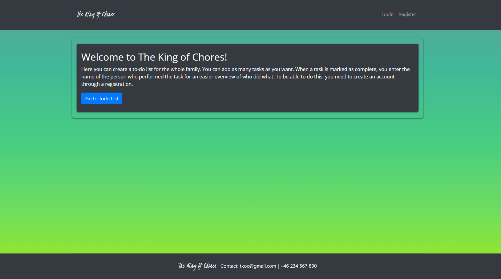
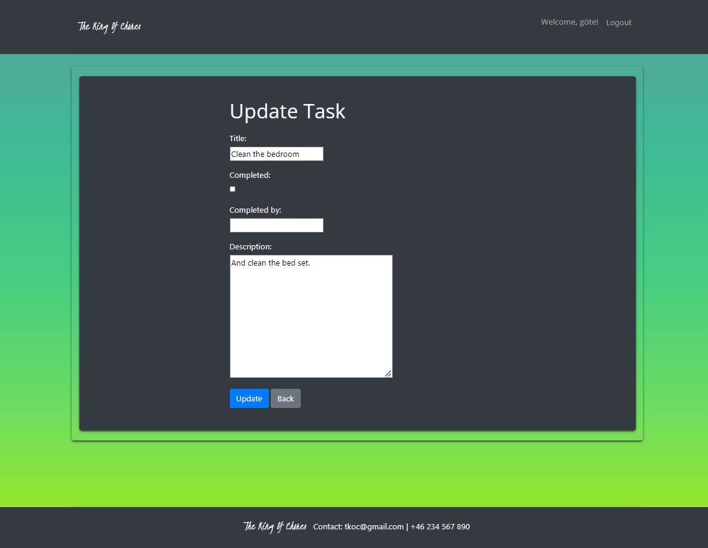
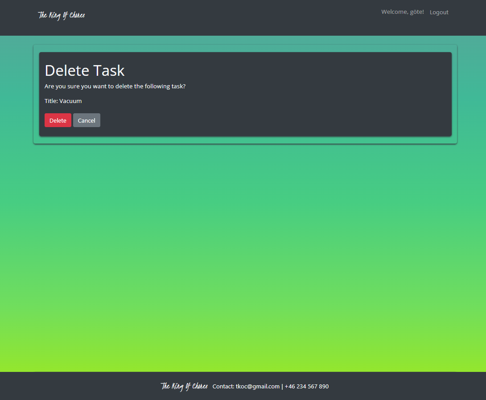
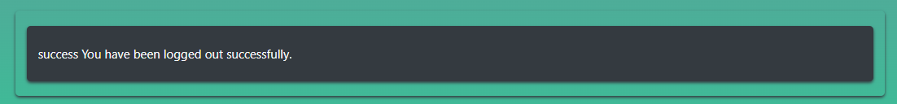

The King Of Chores is a todo list app built with Django. It allows users to create, manage, and complete tasks. 
The target audience for this webapp is families or other groups of people who need a to-do list where they can create a to do list together. And so they can see who did what.

The live link can be found here - [The King Of Chores](https://the-king-of-chores.herokuapp.com/)

## Table of Contents
- [Table of Contents](#table-of-contents)
- [User Experience (UX)](#user-experience-ux)
  - [User Stories](#user-stories)
    - [EPIC | User Profile](#epic--user-profile)
    - [EPIC | List of chores](#epic--list-of-chores)
    - [EPIC | List of chores](#epic--list-of-chores-1)
    - [EPIC | Game Functionality](#epic--game-functionality)
  - [User Stories](#user-stories-1)
    - [Colour Scheme](#colour-scheme)
- [Wireframes](#wireframes)
- [Agile Methodology](#agile-methodology)
- [Data Model](#data-model)
- [Testing](#testing)
- [Security Features and Defensive Design](#security-features-and-defensive-design)
  - [User Authentication](#user-authentication)
  - [Database Security](#database-security)
- [Features](#features)
  - [Header](#header)
  - [Footer](#footer)
  - [Home Page](#home-page)
  - [Todo List page](#todo-list-page)
  - [View page](#view-page)
  - [Edit page](#edit-page)
  - [Delete page](#delete-page)
  - [Register page](#register-page)
  - [Login page](#login-page)
  - [Logout](#logout)
- [Deploy the App to Heroku](#deploy-the-app-to-heroku)
  - [Create a new external database:](#create-a-new-external-database)
  - [Create the Heroku App:](#create-the-heroku-app)
  - [Prepare the environment and settings.py file:](#prepare-the-environment-and-settingspy-file)
  - [Create files / directories:](#create-files--directories)
  - [Update Heroku Config Vars](#update-heroku-config-vars)
  - [Deploy](#deploy)
- [Forking this repository](#forking-this-repository)
- [Cloning this repository](#cloning-this-repository)
- [Languages](#languages)
- [Credits](#credits)

## User Experience (UX)

A visitor to The King Of Chores. Is most likely a small group of people such as a family. 
And with a need to create a common to-do list where they can see what needs to be done and who has done what.

### User Stories

#### EPIC | User Profile
- As a user, I want to be able to log in to my account using my credentials. This allows me to access personalized features and view my own 
  data.
- As a user, I want to be able to create a new account by registering with a username.
  This allows me to have a unique identity within the system and access its functionalities.
- As a user, I want to be able to view my login status. This provides me with information about my authentication status.
- As a user, I want the ability to log out of my account to ensure the security of my personal information and prevent unauthorized access.

#### EPIC | List of chores
- As a user, I want the ability to check off completed chores and mark them with my name. This allows me to take ownership of the tasks I have completed and keep a record of my contributions.
- As a user, I want to be able to view a list of completed chores that are marked with the name of the person who completed them. This helps me track the progress and accountability of each individual.
- As a user, I want to be able to delete unwanted or completed chores from the list. This helps me keep the chore list organized and remove any unnecessary tasks.
- As a user, I want the ability to edit the details of a chore, such as its title, description or how completed task. This allows me to make necessary changes or updates to the tasks as needed.
- As a user, I want to see a comprehensive list of all the chores. This helps me have an overview of the tasks that need to be done.
- As a user, I want the ability to add new chores to the list. This allows me to include new tasks that need to be completed.

The following user stories where labelled as "could have" and "Won't Have" on my project board on Github.

#### EPIC | List of chores
- As a user, I would like the option to select multiple tasks and delete them simultaneously. This provides a more efficient way of managing and removing multiple tasks from the list.

#### EPIC | Game Functionality
- As a user, I want the system to track and display the number of completed tasks for each invited user. This allows me to compare my progress with other users and see how I rank.
- As a user, I would like to see a leaderboard that showcases the top performers based on completed tasks. This adds a competitive element and encourages users to complete more tasks.
- As a user, I want to be able to compete with invited users to see who can complete the highest number of tasks. This creates a sense of competition and motivation among users.
- As a user, I want the system to track and display the number of completed tasks for each invited user. This allows me to compare my progress with other users and see how I rank.

### User Stories

#### Colour Scheme
<small><i><a href='https://coolors.co/ffffff-343a40-5aa29a-40b997-47cd82-70de5d-a8eb12'>Colour palette from Coolors</a></i></small>

The colour scheme of the site is mainly linear-gradient. The rest is bg-dark and text-light boostrap.

The colors are designed with ease of use in mind. 

## Wireframes

 
Login Page

Register Page

Home Page

Todo List Page

View Page

Update Page

Delete Page

## Agile Methodology

Github projects was used to manage the development process using an agile approach. The link to my project board is [here.](https://github.com/users/assofiejakobsson/projects/23)

## Data Model

The diagram below details the database schema.

## Testing

Testing and results can be found [here](/TESTING.md)

## Security Features and Defensive Design

### User Authentication
- The CustomUserCreationForm class extends UserCreationForm and customizes the form's behavior.
 It adds validation for password length, checks for password match, and restricts the username to alphanumeric characters.

 - The CustomAuthenticationForm class extends AuthenticationForm and sets the required attribute for the username and password fields to True.

 - The register view handles user registration. It uses the CustomUserCreationForm to process the registration form. If the form is valid, a new user is created, logged in, and redirected to the home page.

 - The user_login view handles user login. It uses the CustomAuthenticationForm to authenticate the user.
 If the form is valid, the user is logged in and redirected to the to-do list page. If the form is invalid, an error message is displayed.

 - The user_logout view logs out the user using the logout function and redirects them to the home page.
 It also displays a success message using the messages framework.

 - The @login_required decorator is used for the most of the views to ensure that only authenticated users can access it.
 If an unauthenticated user tries to access the view, they will be redirected to the login page.

 - The form classes (UserCreationForm, AuthenticationForm, and TodoForm) are for form validation. Django's form validation ensures that user input is validated and secure.

 - The CSRF tokens and middleware are built in django mechanisms. This are to handle CSRF protection and mitigate the risks associated with CSRF attacks.

 - The 'get_object_or_404' function are for handle object retrieval from the database. This function retrieves an object but raises a 404 HTTP response if the object is not found.
  This helps avoid exposing sensitive information or potential security vulnerabilities.

### Database Security

 - The database url and secret key are stored in the env.py file to prevent unwanted connections to the database.

## Features

### Header

 - The name on the project is the logo. And it is positioned in the top left of the navigation bar. The logo is linked to the home page for ease of navigation for the user and it has a hover efect.
 - The register and login links are to the right whene the user not are loggedin.
 - The register and login links are hidden in a burger navbar in mobile view. And whene the user click on the burger navbar
 the register and login links are displayde under the loggo to the left.

 - The username whit a welcome is displayd on the right side whene someone i logde in. And a logout link are displayd next to the usernam.
 - The logout link and the username are hidden in a burger navbar in mobile view. And whene the user click on the burger navbar
 the logout link and the username are displayde under the loggo to the left.

### Footer 

 - The logo is placed in the middle of the footer and next to the loggo is the contact information.The loggo has a hover function and whene the user click it they ar redirect to the home page.
 Below this in the middle there is an upward arrow with the blue link color and it fits because the main buttons in the app have that color.
 And whene you hover over the arrow a text go to top shown. Whene the user click the arrow the page gos up to the top. The fotter are fixed. This simplifies navigation for the user.

### Home Page

 - The home page is simply designed with a brief description of the app. 
 And it also appears that you need an account to be able to use the app.
  - Below the text there is a button "Go To The Todo List. If you not are logged in it will take you to the login page. if the user is logged in, the user goes directly to the todo list page.
  - The simple design with little content facilitates the user's understanding of what and how the app can be used.

### Todo List page

  - The Todo List page has a simple and user-friendly design.
  - First on the page comes a title "Todo List" First on the page comes a title "Todo List" to clarify what it is.
  - After the title, there are two input fields, one for task title, which is mandatory in order to add tasks. The second input field is optional and it is for description, the reason 
  I have chosen an input field and not a text area is because it both looks nicer and gives a less cluttered impression. And since description is not something that is needed but only a small plus and if you want to edit the task there is a text area. right after both input fields comes an Add Task button.
  - After the add task section there will be two titles the first "Uncompleted Chores" and below this will be "Completed Chores".
  Under "Uncompleted Chores" All tasks that are added and not marked as completed are visible in this section. 
  - Each uncompleted task has four buttons, the first button is "View" and it takes the user to the View page. The second button is "Edit" and it takes the user to the uncompleted update page. The third button is "Delete" and it takes the user to the uncompleted delete page.
   The fourth button is "Complete" And this button brings up a modal where the user can enter who completed the task.
  - The modal has a title "Complete Task" and a cross button that closes the modal. And this comes an input field with lable "Your Name:" And immediately after a button "Submit".
   When the user presses the "Submit" button, the modal disappears and the task appears as completed by: Name under the title "Completed Task"
  - Under "Completed Task" all tasks that have been marked as completed are visible and they also have an overtitle "completed by: name" And all tasks that a name has completed are gathered together under "completed by: name". Each completed task has three buttons, the first is "View" and it takes the user to the View page.
   The second button is "Edit" and it takes the user to the updater completed page. The third is "Delete" and it takes the user to the delete page.

### View page

- First comes a title "Task Title". Which makes it easier for the user to understand where and what it is about.
- After the title. Will the title of the task the user chose to look more closely at and a possible description,
 completed status and who completed the task.
 - After the task details there are two buttons. The first button is "Delete" and it takes the user to the delete page.
  And the second button is "Back" and it takes the user to the todo list page.

### Edit page

- There are two pages for editing, one is for uncompleted tasks. And the other is for the completed tasks but they work and look the same. I never managed to fix the code so I only need one of them, but I will fix that later.
- First comes a title "Update Task". Which makes it easier for the user to understand where and what it is about. 
- After that comes a form with input field for task title, check box for completed, input field, input field for completed by and a text area for description.
- After that there are two buttons, the first one is "Update" and when the user clicks on it, an alert message appears asking if the user is sure it wants to update the task. And there are two buttons on the alert message and one is "Yes" and the other is "Cancel". If the user selects yes, the task is updated and the alert message disappears. If the user selects cancel, the alert message disappears without updating the task.
- The second button next to the "update" button is a "Back" button that takes the user back to the todolist page.

### Delete page

- There are two pages for delete, one is for uncompleted tasks. And the other is for the completed tasks but they work and look the same. I never managed to fix the code so I only need one of them, but I will fix that later.
- First comes a title "Delete Task". Which makes it easier for the user to understand where and what it is about. 
- After that comes a text asking the user if they are sure they want to delete the task. The task's title is below the text, so the user must be sure which task he is talking about.
- After that there are two buttons, the first one is "Delete" and when the user clicks on it the task disappears and the user returns to the todolist page.
- The second button next to the "Delete" button is a "Cancel" button that takes the user back to the todolist page.

### Register page

- First comes a title "Register". Which makes it easier for the user to understand where and what it is about. 
- After that comes a form with input field for username, password, input field and cofirm password.
- Below the username and password input fields are the requirements for the username and password. This helps the user form an approved username and password.
- If the user writes something that does not meet the requirements, an error message appears about what went wrong. This helps the user understand what is wrong so the user can correct it.
- A Register button can be found under the form. And if the user has filled in everything correctly, and clicks on it, the user will be taken to the website as a logged in user.
- At the bottom it says "Already have an account?" and a link "Login" that takes the user to the login page.

### Login page

- First comes a title "Login". Which makes it easier for the user to understand where and what it is about. 
- After that comes a form with input field for username and password.
- After that comes a "Login" button. And if the user has filled in everything correctly, and clicks on it, the user will be taken to the website as a logged in user.
- And if the user enters the wrong username or password, an error message appears. This helps the user understand what is wrong.
- At the bottom it says "Don't have an account?" and a link "Register" that takes the user to the Register page.

### Logout

- When the user is logged in, there is always a logou link at the top right.
- When the user presses the logout link, the user comes to the website with a confirmation message that the user is logged out.

## Deploy the App to Heroku

To deploy your app to Heroku, follow these steps:

### Create a new external database:
- Log in to your ElephantSQL account.
- Copy the DATABASE_URL located in Config Vars in the Settings Tab.
- Click "Create New Instance" and follow the steps outlined in the instructions.
- Copy the ElephantSQL database URL 

### Create the Heroku App:
- Log in to Heroku or create a new account if you don't have one.
- On the main page, click the "New" button in the top right corner and
 select "Create New App" from the drop-down menu.
- Choose a unique and meaningful app name.
- Select the region that is closest to your target audience.
- Click on the "Create App" button.
- Open the settings tab and click "Reveal Config Vars".
- Add a config var called DATABASE_URL and paste the ElephantSQL database URL as the value.

### Prepare the environment and settings.py file:
- In your local development environment, create an env.py file in the main directory of your project.
- Add the DATABASE_URL value and your chosen SECRET_KEY value to the env.py file. 
- Update the settings.py file to import the env.py file and configure the SECRET_KEY and DATABASE_URL.
- Comment out the default database configuration in the settings.py file.
- Save the files and run the necessary migrations.
- If using Cloudinary, add the Cloudinary URL to the env.py file.
- Include the Cloudinary libraries in the list of installed apps.
- Configure the STATIC files settings, including the URL, storage path, directory path, root path, media URL, and default file storage path.
- Link the file to the templates directory in Heroku.
- Change the templates directory variable to TEMPLATES_DIR.
- Add the Heroku app URL to the ALLOWED_HOSTS list, using the format ['app_name.heroku.com', 'localhost'].

### Create files / directories:
- Create requirements.txt file
- Create three directories in the main directory; assets, static and templates. 
- Create a file named "Procfile" in the main directory and add the following: web: gunicorn TheKingOfChores.wsgi

### Update Heroku Config Vars
Add the following Config Vars in Heroku:
- SECRET_KEY value 
- CLOUDINARY_URL
- PORT = 8000

### Deploy
- Make sure that the DEBUG setting in your Django settings is set to False.
- In the Heroku Dashboard, go to the "Deploy" tab of your app.
- Connect your app to your GitHub repository by selecting the repository and branch.
- Scroll down to the deployment options and choose whether to enable automatic deploys or deploy manually by clicking the "Deploy Branch" button.
- Wait for the deployment process to complete.
- Click View to view the deployed site.

The site is now live. 

## Forking this repository
- Locate the repository at this link [The King Of Chores](https://github.com/assofiejakobsson/the-king-of-chores).
- At the top of the repository, on the right side of the page, select "Fork" from the buttons available. 
- A copy of the repository is now created.

## Cloning this repository
To clone this repository follow the below steps: 

- Go to the repository at this link [The King Of Chores](https://github.com/assofiejakobsson/the-king-of-chores). 
- Under the "Code" button, select your preferred cloning option (HTTPS, SSH, or GitHub CLI) and copy the provided URL. 
- Open your Terminal or command-line interface.
- Navigate to the directory where you want to clone the repository.
- Type git clone and then paste the URL you copied from GitHub. 
- Press "Enter" to create the local clone of the repository.

## Languages

- Python
- HTML
- CSS
- Javascript

## Credits

- This repository was created using the template provided by Code Institute. [Code Institute Template](https://github.com/Code-Institute-Org/ci-full-template)
- To get the Django framework installed and set up I followed the Code institutes [Django Blog cheatsheet](https://codeinstitute.s3.amazonaws.com/fst/Django%20Blog%20Cheat%20Sheet%20v1.pdf)
- Fore the README.md and TESTING.md I have followed the README.md in these repositories. [README.md](https://github.com/AliOKeeffe/PP4_My_Meal_Planner/blob/main/README.md)
- My starting code I get from [Hello Django](https://learn.codeinstitute.net/ci_program/diplomainsoftwaredevelopmentecomm)from Code Institut [Youtube](https://www.youtube.com/watch?v%253DllbtoQTt4qw).
- I have received a lot of help from tutors at Code Institute, but above all with marking tasks with names.
- I have had a lot of help from this page when trying to understand what to do and why.[w3schools](https://www.w3schools.com/django/django_templates.php)
- I have used this to create my favicon.[favicon](https://favicon.io/favicon-generator/)
- I have used this to understand how to implement wrapper in the html and css.[wrapper](https://css-tricks.com/best-way-implement-wrapper-css/)
- For my background i have used a gardient and I created that here. [gardient](https://mycolor.space/gradient?ori%253Dto%252Bbottom%2526hex%253D%2523053337%2526hex2%253D%2523A8EB12%2526sub%253D1)

[Back to Table of contents](#table-of-contents)

