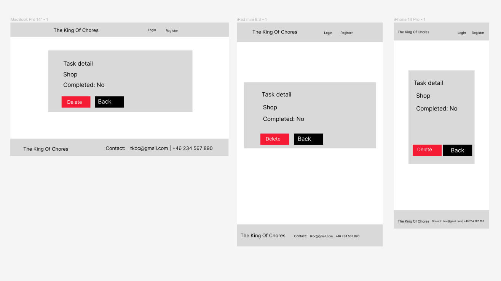

The King Of Chores is a todo list app built with Django. It allows users to create, manage, and complete tasks. 
The target audience for this webapp is families or other groups of people who need a to-do list where they can create a to do list together. And so they can see who did what.

The live link can be found here - [The King Of Chores](https://the-king-of-chores.herokuapp.com/)

<!-- <small><i><a href='http://ecotrust-canada.github.io/markdown-toc/'>Table of contents generated with markdown-toc</a></i></small> -->
## User Experience (UX)

A visitor to The King Of Chores. Is most likely a small group of people such as a family. 
And with a need to create a common to-do list where they can see what needs to be done and who has done what.

### User Stories

#### EPIC | User Profile
- As a user, I want to be able to view my login status. This provides me with information about my authentication status.
- As a user, I want the ability to log out of my account to ensure the security of my personal information and prevent unauthorized access.
- As a user, I want to be able to log in to my account using my credentials. This allows me to access personalized features and view my own 
  data.
- As a user, I want to be able to create a new account by registering with a username.
  This allows me to have a unique identity within the system and access its functionalities.

#### EPIC | List of chores
- As a user, I want the ability to check off completed chores and mark them with my name. This allows me to take ownership of the tasks I have completed and keep a record of my contributions.
- As a user, I want to be able to view a list of completed chores that are marked with the name of the person who completed them. This helps me track the progress and accountability of each individual.
- As a user, I want to be able to delete unwanted or completed chores from the list. This helps me keep the chore list organized and remove any unnecessary tasks.
- As a user, I want the ability to edit the details of a chore, such as its title, description or how completed task. This allows me to make necessary changes or updates to the tasks as needed.
- As a user, I want to see a comprehensive list of all the chores. This helps me have an overview of the tasks that need to be done.
- As a user, I want the ability to add new chores to the list. This allows me to include new tasks that need to be completed.

The following user stories were labelled as "could have" and "Won't Have" on my project board on Github.

#### EPIC | List of chores
- As a user, I would like the option to select multiple tasks and delete them simultaneously. This provides a more efficient way of managing and removing multiple tasks from the list.

#### EPIC | Game Functionality
- As a user, I want the system to track and display the number of completed tasks for each invited user. This allows me to compare my progress with other users and see how I rank.
- As a user, I would like to see a leaderboard that showcases the top performers based on completed tasks. This adds a competitive element and encourages users to complete more tasks.
- As a user, I want to be able to compete with invited users to see who can complete the highest number of tasks. This creates a sense of competition and motivation among users.
- As a user, I want the system to track and display the number of completed tasks for each invited user. This allows me to compare my progress with other users and see how I rank.

### User Stories

#### Colour Scheme
<small><i><a href='https://coolors.co/ffffff-343a40-5aa29a-40b997-47cd82-70de5d-a8eb12'>Colour palette from Coolors</a></i></small>

The colour scheme of the site is mainly linear-gradient. The rest is bg-dark and text-light boostrap.

The colors are designed with ease of use in mind. 

 
Login Page

Register Page

Home Page

Todo List Page

View Page

Update Page

Delete Page

## Agile Methodology

Github projects was used to manage the development process using an agile approach. The link to my project board is [here.](https://github.com/users/assofiejakobsson/projects/23)

## Data Model

The diagram below details the database schema.

## Testing

Testing and results can be found [here](/TESTING.md)

Bug 

I tried to get the Cancel link in a button.
 <button><a href="">Cancel</a></button>

 I fixed it using Javascript.
 <button type="button" id="cancelButton">Cancel</button>
  

  My modal Disappeared when I added bootstrap. The problem was that I had the wrong version of boostrap. I found the correct version by checking in the devcontainer.json.

.wrapper. https://css-tricks.com/best-way-implement-wrapper-css/

https://mycolor.space/gradient?ori=to+bottom&hex=%23053337&hex2=%23A8EB12&sub=1

Welcome,

This is the Code Institute student template for Codeanywhere. We have preinstalled all of the tools you need to get started. It's perfectly ok to use this template as the basis for your project submissions.

You can safely delete this README.md file, or change it for your own project. Please do read it at least once, though! It contains some important information about Codeanywhere and the extensions we use. Some of this information has been updated since the video content was created. The last update to this file was: **March 3rd, 2023**

## Codeanywhere Reminders

To run a frontend (HTML, CSS, Javascript only) application in Codeanywhere, in the terminal, type:

`python3 -m http.server`

A button should appear to click: _Open Preview_ or _Open Browser_.

To run a backend Python file, type `python3 app.py`, if your Python file is named `app.py` of course.

A button should appear to click: _Open Preview_ or _Open Browser_.

In Codeanywhere you have superuser security privileges by default. Therefore you do not need to use the `sudo` (superuser do) command in the bash terminal in any of the lessons.

To log into the Heroku toolbelt CLI:

1. Log in to your Heroku account and go to _Account Settings_ in the menu under your avatar.
2. Scroll down to the _API Key_ and click _Reveal_
3. Copy the key
4. In Codeanywhere, from the terminal, run `heroku_config`
5. Paste in your API key when asked

You can now use the `heroku` CLI program - try running `heroku apps` to confirm it works. This API key is unique and private to you so do not share it. If you accidentally make it public then you can create a new one with _Regenerate API Key_.

---

Happy coding!
