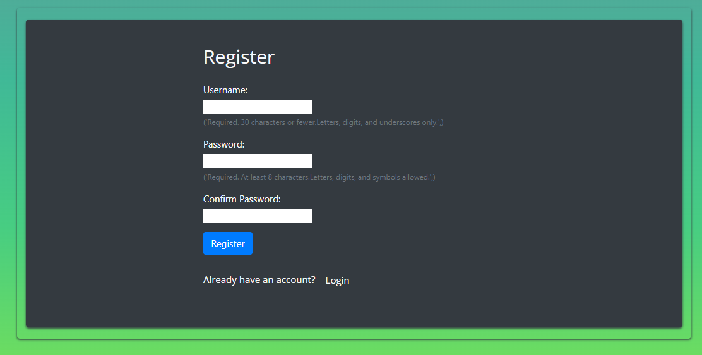

## User Story Testing

### EPIC |Profile
*As a user, I want to be able to create a new account by registering with a username.
  This allows me to have a unique identity within the system and access its functionalities.*

 - On the landing page, there is a short explanation in the middle of the page about the app. In the explanation, it appears that you need to register to be able to use the app.
 - At the top right corner there is a link to the registration.
 

 - When the user clicks on register, the user comes to the registration form.

 
 - And if the user misses the information and the link to the registration. And just clicking directly on the button Go To Todolist, the unregistered user will go directly to the login page. Under login formed it says Don't have an account? and a link to register.
 - All these steps are there to make it easy for the user to register.
 - When the user is registered the user have unique identity within the system and access its functionalities.

*As a user, I want to be able to log in to my account using my credentials. This allows me to access personalized features and view my own 
  data.*

 - There is a login link on the right at the top of the landing page that takes the user to the login page.
 - And if the user misses the login link. And just clicking directly on the button Go To Todolist, the logdout user will go directly to the login page.
 - These steps make it easy for the user to find and log in. And the loggde in user get access personalized features and view my own 
  data.

*As a user, I want to be able to view my login status. This provides me with information about my authentication status.*

 - At the top right corner it says welcome and the logged in user's username, so that the user can see that they are logged in and feel welcome.

*As a user, I want the ability to log out of my account to ensure the security of my personal information and prevent unauthorized access.*

 - At the top right corner there is a link to log out for the logged in user.

 - When the logged in user clicks on log out, they are taken back to the landing page as logged out.

### EPIC | List of chores
- As a user, I want the ability to check off completed chores and mark them with my name. This allows me to take ownership of the tasks I have completed and keep a record of my contributions.
- As a user, I want to be able to view a list of completed chores that are marked with the name of the person who completed them. This helps me track the progress and accountability of each individual.
- As a user, I want to be able to delete unwanted or completed chores from the list. This helps me keep the chore list organized and remove any unnecessary tasks.
- As a user, I want the ability to edit the details of a chore, such as its title, description or how completed task. This allows me to make necessary changes or updates to the tasks as needed.
- As a user, I want to see a comprehensive list of all the chores. This helps me have an overview of the tasks that need to be done.
- As a user, I want the ability to add new chores to the list. This allows me to include new tasks that need to be completed.

