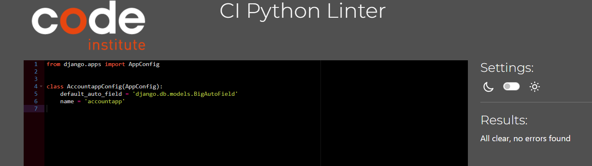
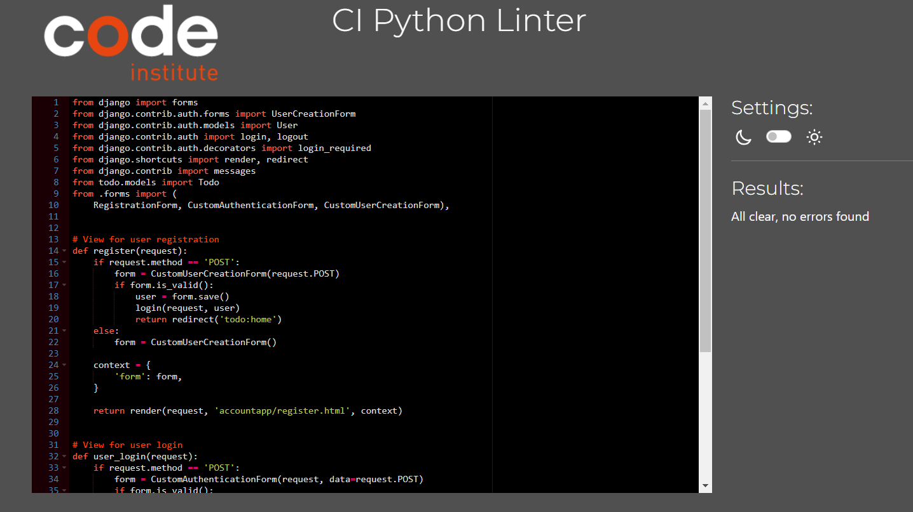

## Table of Contents
- [Table of Contents](#table-of-contents)
- [User Story Testing](#user-story-testing)
  - [EPIC |Profile](#epic-profile)
  - [EPIC | List of chores](#epic--list-of-chores)
- [Validator Testing](#validator-testing)
  - [HTML](#html)
  - [CSS](#css)
  - [Javascript](#javascript)
  - [Python](#python)
  - [Lighthouse](#lighthouse)
- [Browser Testing](#browser-testing)
- [Device Testing](#device-testing)
- [Manual Testing](#manual-testing)
  - [Header](#header)
  - [Register page](#register-page)
  - [Login page](#login-page)
  - [Home page](#home-page)
  - [Todo list page](#todo-list-page)
  - [View page](#view-page)
  - [Edit page](#edit-page)
  - [delete page](#delete-page)
  - [Edit completed page](#edit-completed-page)
  - [Delete completed page](#delete-completed-page)
  - [Fotter](#fotter)
- [Bugs](#bugs)
  - [Fixed Bugs](#fixed-bugs)
  - [Unfixed bugs:](#unfixed-bugs)

## User Story Testing

### EPIC |Profile
*As a user, I want to be able to create a new account by registering with a username.
  This allows me to have a unique identity within the system and access its functionalities.*

 - On the landing page, there is a short explanation in the middle of the page about the app. In the explanation, it appears that you need to register to be able to use the app.
 - At the top right corner there is a link to the registration.
 

 - When the user clicks on register, the user comes to the registration form.

 
 - And if the user misses the information and the link to the registration. And just clicking directly on the button Go To Todolist, the unregistered user will go directly to the login page. Under login formed it says Don't have an account? and a link to register.
 - All these steps are there to make it easy for the user to register.
 - When the user is registered the user have unique identity within the system and access its functionalities.

*As a user, I want to be able to log in to my account using my credentials. This allows me to access personalized features and view my own 
  data.*

 - There is a login link on the right at the top of the landing page that takes the user to the login page.
 - And if the user misses the login link. And just clicking directly on the button Go To Todolist, the logdout user will go directly to the login page.
 - These steps make it easy for the user to find and log in. And the loggde in user get access personalized features and view my own 
  data.

*As a user, I want to be able to view my login status. This provides me with information about my authentication status.*

 - At the top right corner it says welcome and the logged in user's username, so that the user can see that they are logged in and feel welcome.

*As a user, I want the ability to log out of my account to ensure the security of my personal information and prevent unauthorized access.*

 - At the top right corner there is a link to log out for the logged in user.
 - When the user logs out, a success logout message appears on the homepage so that the user can see their status.

 - When the logged in user clicks on log out, they are taken back to the landing page as logged out.

### EPIC | List of chores
*As a user, I want the ability to add new chores to the list. This allows me to include new tasks that need to be completed.*
*As a user, I want to see a comprehensive list of all the chores. This helps me have an overview of the tasks that need to be done.*

- There is the possibility to add as many details with description as the user wants.
- The list shows uncompleted and completed tasks. This makes it easy for the user to see what needs and does not need to be done.

*As a user, I want the ability to check off completed chores and mark them with my name. This allows me to take ownership of the tasks I have completed and keep a record of my contributions.*
*As a user, I want to be able to view a list of completed chores that are marked with the name of the person who completed them. This helps me track the progress and accountability of each individual.*

 - At the far right next to each unfinished task there is a completed button. When the user clicks on it, a modal appears where the user can enter the name of the person who performed the task.
 - The user can see who did what as the completed tasks are grouped by the names of those who completed them.

*As a user, I want the ability to view and edit the details of a chore, such as its title, description or how completed task. This allows me to make necessary changes or updates to the tasks as needed.*

 - The user has the opportunity to view and update both completed and unfinished tasks.
 - In order for the user to avoid unnecessary careless errors, a prompt message appears when the user clicks on update.

*As a user, I want to be able to delete unwanted or completed chores from the list. This helps me keep the chore list organized and remove any unnecessary tasks.*

 - The user has the option to delete completed and uncompleted tasks.

*As an admin, I want to have ful CRUD functionality for the users.*

 - Admins have full access to CRUD functionality for all users and all tasks.

## Validator Testing

### HTML 

The web app was Validate by URI [W3C HTML Validator](https://validator.w3.org/). And it was no errors or warnings. See the images below.

Html

### CSS

The web app was Validate by URI [W3C CSS Validator](https://jigsaw.w3.org/css-validator/) And it was no errors or warnings. See the images below.

Css

### Javascript

No errors were found, but One undefined variable "$". it belongsnd  jQuery library. [Jshint](https://jshint.com/) 

Jshint

### Python

No errors were found, but One undefined variable "$". it belongsnd  jQuery library. [CI Python Linter](https://pep8ci.herokuapp.com/)

CI Python Linter

### Lighthouse

Lighthouse validation was run on all pages (both mobile and desktop) in order to check accessibility, performance, Best Practices and SEO. At first I received issues for my lables for name. And this is the result after I fixed it.

| Page           | Performance  | Accessibility | Best Practices  | SEO |
|----------------|:------------:|:-------------:|:---------------:|:---:|
|                |              |               |                 |     |
| Mobile         |              |               |                 |     |
| Home           |           94 |            97 |              92 | 100 |
| Todo list      |           84 |            95 |              92 | 100 |
| View task      |           84 |            98 |              92 | 100 |
| Update task    |           86 |            97 |              92 | 100 |
| Delete task    |           86 |           100 |              92 | 100 |
| Login          |           88 |            97 |              92 | 100 |
| Register       |           90 |            97 |              92 | 100 |
|                |              |               |                 |     |
| Desktop        |              |               |                 |     |
| Home           |           94 |           100 |             100 | 100 |
| Todo list      |           94 |           100 |             100 | 100 |
| View task      |           93 |            98 |             100 | 100 |
| Update task    |           86 |            98 |             100 | 100 |
| Delete task    |           94 |           100 |             100 | 100 |
| Login          |           95 |           100 |             100 | 100 |
| Register       |           95 |           100 |             100 | 100 |

## Browser Testing
- I have tested the web app on Google Chrome, Firefox, Safari and Edge browsers with no issues noted.

## Device Testing
- The web app was viewed on a variety of devices such as Laptop, iPad, samsung s21, s9, zflip 4 and motorola g8 plus. to ensure responsiveness on various screen sizes and bugs.

## Manual Testing

### Header
| Element                | Action     | Expected Result                                                             | Pass/Fail |
|------------------------|------------|-----------------------------------------------------------------------------|-----------|
| Header                 |            |                                                                             |           |
| Site Name (logo)       | Click      | Redirect to home                                                            | Pass      |
| Register Link          | click      | Visible when the user is not logged in and redirect to the register page.   | Pass      |
| Log In Link            | Click      | Visible when the user is not logged in and redirect to the register page.   | Pass      |
| Log Out Link           | Click      | Visible when the user is logged in and redirect to the home page. Success message| Pass |

### Register page 
| Element                | Action     | Expected Result                                                             | Pass/Fail |
|------------------------|------------|-----------------------------------------------------------------------------|-----------|
| Register page          |            |                                                                             |           |
| Register form          | Display    | Inputfields for username, password, register btn. Login link                | Pass      |
| Register(btn)          | Click      | The user get an account and redirects to the home page as logdein           | Pass      |
| Login link             | Click      | Redirect to the login page                                                  | Pass      |

### Login page 
| Element                | Action     | Expected Result                                                             | Pass/Fail |
|------------------------|------------|-----------------------------------------------------------------------------|-----------|
| Register page          |            |                                                                             |           |
| Login form             | Display    | Inputfields for username, password, login btn. Register link                | Pass      |
| Login(btn)             | Click      | Redirects to the home page as logdein                                       | Pass      |
| Register link          | Click      | Redirect to the register page                                               | Pass      |

### Home page
| Element                | Action     | Expected Result                                                             | Pass/Fail |
|------------------------|------------|-----------------------------------------------------------------------------|-----------|
| Home page              |            |                                                                             |           |
| About information      | Display    |                                                                             | Pass      |
| Go To The Todo List btn| click      | Redirect the todo list                                                      | Pass      |

### Todo list page
| Element                | Action     | Expected Result                                                             | Pass/Fail |
|------------------------|------------|-----------------------------------------------------------------------------|-----------|
| Todo list page         |            |                                                                             |           |
| Add task (btn)         | Click      | Add task to the todo list                                                   | Pass      |
| View Todolist          | Display    | Ful todolist overview whit task status                                      | Pass      |
| Add task (btn)         | Click      | Add task to the todo list                                                   | Pass      |
| View uncompledted(btn) | Click      | Redirect to the View page                                                   | Pass      |
| Edit uncompleted(btn)  | Click      | Redirect to the Edit page                                                   | Pass      |
| Delete uncompleted(btn)| Click      | Redirect to the Edit page                                                   | Pass      |
| Complete(btn)          | Click      | Modal pop up                                                                | Pass      |
| Modal                  | Display    | Whit inputfield for the name hwo completed the task and submit(btn)         | Pass      |
| Modal submit(btn)      | Click      | The completed task marks as completed by the name in the inputfield         | Pass      |
| Modal "X"(btn)         | Click      | The modal disepear                                                          | Pass      |
| View compledted(btn)   | Click      | Redirect to the view page                                                   | Pass      |
| Edit compledted(btn)   | Click      | Redirect to the completed edit page                                         | Pass      |
| Delete compledted(btn) | Click      | Redirect to the completed deleted page                                      | Pass      |
| View Todolist          | Display    | Ful todolist overview whit task status                                      | Pass      |

### View page 
| Element                | Action     | Expected Result                                                             | Pass/Fail |
|------------------------|------------|-----------------------------------------------------------------------------|-----------|
| View page              |            |                                                                             |           |
| Task details           | Display    | View tas title, description, completed status and completed by name         | Pass      |
| Delete(btn)            | Click      | Redirect to the delete page                                                 | Pass      |
| Back(btn)              | Click      | Redirect to the todo list page                                              | Pass      |

### Edit page 
| Element                | Action     | Expected Result                                                             | Pass/Fail |
|------------------------|------------|-----------------------------------------------------------------------------|-----------|
| Edit page              |            |                                                                             |           |
| Form update            | Display    | Inputfields for title, description, completed check and completed by name   | Pass      |
| Update(btn)            | Click      | Alert confirm message for update the task pop up                            | Pass      |
| Alert ok(btn)          | Click      | Update the task                                                             | Pass      |
| Alert cancel(btn)      | Click      | The task dose not update                                                    | Pass      |
| Back(btn)              | Click      | Redirect to the todo list page                                              | Pass      |

### delete page 
| Element                | Action     | Expected Result                                                             | Pass/Fail |
|------------------------|------------|-----------------------------------------------------------------------------|-----------|
| Delete page            |            |                                                                             |           |
| View delete page       | Display    | Confirm message for delete the chosen task                                  | Pass      |
| Delete(btn)            | Click      | Task disepear and the user redirects to the todo list                       | Pass      |
| Cancel(btn)            | Click      | redirect to the todo list                                                   | Pass      |

### Edit completed page 
| Element                | Action     | Expected Result                                                             | Pass/Fail |
|------------------------|------------|-----------------------------------------------------------------------------|-----------|
| Edit page              |            |                                                                             |           |
| Form update            | Display    | Inputfields for title, description, completed check and completed by name   | Pass      |
| Update(btn)            | Click      | Alert confirm message for update the task pop up                            | Pass      |
| Alert ok(btn)          | Click      | Update the task                                                             | Pass      |
| Alert cancel(btn)      | Click      | The task dose not update                                                    | Pass      |
| Back(btn)              | Click      | Redirect to the todo list page                                              | Pass      |

### Delete completed page 
| Element                | Action     | Expected Result                                                             | Pass/Fail |
|------------------------|------------|-----------------------------------------------------------------------------|-----------|
| Delete page            |            |                                                                             |           |
| View delete page       | Display    | Confirm message for delete the chosen task                                  | Pass      |
| Delete(btn)            | Click      | Task disepear and the user redirects to the todo list                       | Pass      |
| Cancel(btn)            | Click      | redirect to the todo list                                                   | Pass      |

### Fotter
| Element                | Action     | Expected Result                                                             | Pass/Fail |
|------------------------|------------|-----------------------------------------------------------------------------|-----------|
| Fotter                 |            |                                                                             |           |
| Site Name (logo)       | Click      | Redirect to home                                                            | Pass      |
| Contact information    | Display    | View contact info as email and Phone number                                 | Pass      |

## Bugs 

### Fixed Bugs

 - I had problems with the return redirect link, I tried, among other things, return redirect('todo/todo_list,html'), return redirect('todo_list') and return redirect(reverse_lazy('todo_list'). Finally I got help from tutor and fich it works with this line return redirect('todo:todo_list').

 - My modal Disappeared when I added bootstrap. The problem was that I had the wrong version of boostrap. I found the correct version by checking in the devcontainer.json. To understand this, I turned to slack.

 - I tried to get the Cancel link in a button.
 <button><a href="">Cancel</a></button>

 I fixed it using Javascript.
 <button type="button" id="cancelButton">Cancel</button>
  

  ### Unfixed bugs:

There are no known unfixed bug. 

[Back to Table of contents](#table-of-contents)

